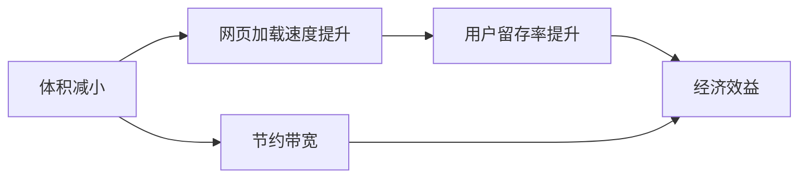
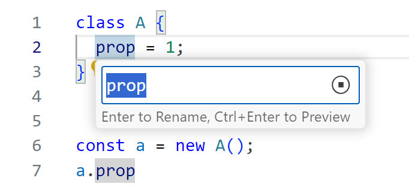

# JsShaker

语义层面的 JavaScript 代码体积优化器

---

# Motivations



---
dragPos:
  semantic: 362,129,385,80
  grammar: 362,230,421,80
  binary: 362,300,388,56
  note: 362,384,406,80
  title: 362,48,388,56
---

<div v-drag="'title'">

# The Levels

</div>

```js {*}{lines:false}
function greet(name) {
  pure();
  console.log("Hello, " + name);
}
greet("World");
```

```js {*}{lines:false}
function greet() {
  console.log("Hello, World");
}
greet();
```

```js {*}{lines:false,class:'children:children:children:(text-wrap break-all)'}
function greet(){console.log("Hello, World")}greet();
```

```txt {*}{lines:false}
010100110010101...
```

<div v-drag="'semantic'">

**Semantic Level** <br>
Tree-shaking，静态分析程序，优化不必要的代码

</div>
<div v-drag="'grammar'">

**Syntax Level** <br>
Minifier\*，上下文无关，删除空格、重命名变量等

</div>
<div v-drag="'binary'">

**Binary Level** <br>
Gzip，编程语言无关，减小传输体积

</div>
<div v-drag="'note'" op-50 text-sm>

\* 许多 Minifier 也会做简单的 Semantic Level 优化

</div>


<style>
.slidev-code-wrapper {
  width: 38%;
}
.shiki {
  --uno: mt-4;
}
</style>

---

# Why Hard?

<!-- JavaScript 作为弱类型的解释型语言，具有高度的动态特性。它使用基于原型链的继承机制，并允许使用动态计算的属性名添加、删除和修改对象的属性和方法。这些特性使得 JavaScript 代码的静态分析变得非常困难。 -->

<div flex justify-between gap-8 pr-12>
<div>

- 弱类型
- 原型链＋动态属性名
- 函数是一等公民

</div><div>

- 真实存在的各种写法
- 大量代码无法精确分析

</div><div>

- 做最坏的假设
- 但又要保证效果

</div>
</div>

<div grid grid-cols-2 gap-4>
<div>

```js {*}{lines:false}
let counter = 0;
const key = () => counter++;
const obj = {
  __proto__: {
    [key()]: 1,
  },
  set [key()](x) {
    console.log(super[key()], x);
  }
}
obj[key()] = 10;
```

</div>
<div>

```js {*}{lines:false}
function cache(fn) {
  const cache = {};
  return x => cache[x] ??= fn(x);
}

const sigmoid = cache(
  x => 1 / (1 + Math.exp(-x))
);

// WTF?
setTimeout(sigmoid, 1000, 1);
```

</div>
</div>

---

# Previous Work

Rollup, Terser, UglifyJS, Google Closure Compiler

缺陷：

- 基于规则，多 pass
- 缺少对象属性的重命名
- 高级优化要求所有的函数和对象都已知
- 可拓展性弱

---

Previous Work{.sect}

## Prepack

- 由 Facebook 推出，于 2021 年废弃
- 思路：按照标准执行 JS 代码，收集副作用并重新生成 JS 代码

```js
for (let a = 1; a < 10; a++)
  console.log(a)
```
转化为
```js
console.log(1);
console.log(2);
// ... 10
```

- 失败原因：内部实现过于复杂；要求整个运行环境已知，无法实际使用

---

# The Goal

- **High precision**: inter-procedural, context-sensitive and field-sensitive.
- **Soundiness**: 在合理的假设下，优化结果是正确的。
- **Single pass**: 优化是幂等的，只需执行一次。确保使用到全局的所有信息，并保证了优化效率。
- **Extendability**: 允许解耦地自定义外部函数的行为，提供专门的优化。

---

# Design Overview

<DesignOverview />

---
class: Execution
---

## Analyzer{.sect} 顺序执行

<div grid grid-cols-2 gap-4>

```js {5|1|2|3}
function [[add]]([[x]], [[y]]) {
  const [[z]] = x + y;
  console.log(z);
}
add([[1]], [[2]]);
```

<div>

### Execution Dependencies

<v-clicks at="1">

- <Dep>add</Dep>

</v-clicks>

### Expressions

<v-clicks at="0">

- `add`: Function(L1-L4) <Deps float-right>1</Deps>
- `x`: Number(1) <Deps float-right>2,5</Deps> <br>
  `y`: Variable("y") <Deps float-right>3,6</Deps>
- `z`: Number(3) <Deps float-right>4,x,y</Deps>
- `console.log`: Unknown <Deps float-right></Deps>

</v-clicks>

</div>
</div>

---
class: Execution
---

## Analyzer{.sect} 分支

<div grid grid-cols-2 gap-4>

```js {1|2|3|4}
let [[x]] = 1;
if (a)
  x++;
console.log(x);
```

<div>

### Execution Dependencies

<div v-click="[2,3]">

- `a` is truthy

</div>

### Expressions

<v-clicks at="0">

- `x`: Number(1) <Deps float-right>1</Deps>
- `a`: Unknown <Deps float-right></Deps>
- `x'`: Number(2) <Deps float-right>x</Deps>
- `x''`: Union\[`x`, `x'`\] <Deps float-right>a</Deps> <br>
  `console.log`: Unknown <Deps float-right></Deps>

</v-clicks>

</div>
</div>

---
class: Execution
---

## Analyzer{.sect} 乱序


<div grid grid-cols-2 gap-4>

```js {1|2|3|6|3|7|8|3}
let x = 0, y = 0;
setInterval(() => {
  console.log(x, y);
}, 100);
// ...
x++;
x++;
y++;
```

<div mr--10>

<v-clicks at="1">

- `setInterval` 在未知时刻调用回调
- 先分析一次，发现依赖是 <Deps>x,y</Deps>
- `x` 改变了，它是回调函数的依赖
- 重新分析回调函数。新的依赖是 <Deps>y</Deps>
- `x` 又改变了，但它不再是回调函数的依赖
- `y` 改变了，它是回调函数的依赖
- 重新分析回调函数。新的依赖是 <Deps></Deps>

</v-clicks>

</div>
</div>

---

- **Drain**：每当自己写入了自己先前的依赖，就重新分析
- **Callback**：自己执行完后，对它的依赖的写入也需要触发重新分析

<div h-4 />

| **Kind** | **Drain** | **Callback** |
| ---- | ---- | ---- |
| Loop | Yes | No |
| Recursion | Yes | Yes |
| Generator / async | No | Yes |
| Untrackable | Yes | Yes |

---

## Optimizer{.sect} 死分支消除

<div fixed left-0 top-6>
<div absolute left-14 top-6>
<code>cond</code>
</div>

<div absolute left-14 top-24>

```js {*}{lines:false,class:'w-32'}
if (cond) A;
else B;
```

</div>
<div absolute left-80 top-24>

```js {*}{lines:false,class:'w-32'}
if (cond) A;
else B;
```

</div>
<div absolute left-80 top-48>

```js {*}{lines:false,class:'w-32'}
A;
```

</div>
<div absolute left-80 top-68>

```js {*}{lines:false,class:'w-32'}
B;
```

</div>
<div absolute left-146 top-24>

```js {*}{lines:false,class:'w-32'}
if (cond) A;
else B;
```

</div>
<div absolute left-146 top-48>

```js {*}{lines:false,class:'w-32'}
if (cond) A;
```

</div>
<div absolute left-146 top-68>

```js {*}{lines:false,class:'w-32'}
if (!cond) B;
```

</div>
</div>

---

## Optimizer{.sect} 死分支消除

没有副作用的分支是什么？

<div flex gap-8>
<div>

```js {*}{lines:false,class:'w-64'}
function f(cond, callback) {
  if (cond) {
    callback();
  } else {
    console.log("else");
  }
}
```

<div mt-4 italic op-80 text-sm> All usages: </div>

```js {*}{lines:false,class:'w-64 mt--4'}
f(truthyValue, pureFunction);
f(falsyValue, anyFunction);
```

</div>
<div>

<div i-carbon-arrow-right w-20 text-4xl op-60 mt-4 />

</div>
<div>

```js {*}{lines:false,class:'w-64'}
function f() {
	console.log("else");
}
```

<div>

TODO:

</div>
</div>
</div>

---


---

### 常量折叠

```js {*}{lines:false}
const a = 1 + 2;
```

---

## Optimizer{.sect} Property Name Mangling

<div />

Minifier 能完美地重命名变量名，比如：

```js {*}{lines:false}
const variableName = { propertyName: 42 };
log(variableName.propertyName * 2);
```

输出为：

```js {*}{lines:false}
let e={propertyName:42};log(e.propertyName*2)
```

但 `propertyName` 仍是原始的字符串。

据估计，属性名约占 Minifier 输出代码体积的 30%。

---

## Optimizer{.sect} Property Name Mangling

[Terser](https://terser.org/) 和 [UglifyJS](https://github.com/mishoo/UglifyJS/) 支持此功能，但无法保证基本的正确性。比如：

```js {*}{lines:false}
const obj = { foo: v1, bar: v2 };
const key = t1 ? "foo" : "bar";
log(obj.foo, obj[key]);
```

会被错误地优化为：

```js {*}{lines:false}
const obj = { a: v1, b: v2 };
const key = t1 ? "foo" : "bar";
log(obj.a, obj[key]);
```

基于规则的局限性：效果好和正确性不可兼得 {.text-xl}

---

## Optimizer{.sect} Property Name Mangling

#### VSCode's Typing-based Approach {.my-4}

- 自动调用 TypeScript 提供的**代码重构**功能来重命名属性名
- 相对安全的属性压缩
- 缺点：正确性依赖于类型注解的准确性；无法处理第三方库的代码
- 无法用于一般的应用程序

其[官方博客](https://code.visualstudio.com/blogs/2023/07/20/mangling-vscode)指出，这种方式减小了 14% 的体积。



---

## Optimizer{.sect} Property Name Mangling

优化的本质是重命名字符串，比如将：

```js {*}{lines:false}
const s1 = "hello";
const s2 = unknown ? "hello" : "world";
console.log(s1 === s2);
```

优化为：

```js {*}{lines:false}
const s1 = "a";
const s2 = unknown ? "a" : "b";
console.log(s1 === s2);
```

---
class: Execution
---

## Optimizer{.sect} Property Name Mangling

```js {1|2|3}
const a = "[[hello]]";
const b = unknown ? "[[hello]]" : "[[world]]";
const c = a === b;
```

<v-clicks at="0">

- `a`: String("hello") <Deps float-right>atom(1)</Deps>
- <code>b<sub>1</sub></code>: String("hello") <Deps float-right>atom(2)</Deps>
<br> <code>b<sub>2</sub></code>: String("world") <Deps float-right>atom(3)</Deps>
<br> `b`: Union\[<Dep><code>b<sub>1</sub></code></Dep>, <Dep><code>b<sub>2</sub></code></Dep>\] <Deps float-right></Deps>
- <code>c<sub>1</sub></code>: Boolean(true) <Deps float-right v-mark.box.red="{at:3}"><span><span text-dep>EQUAL</span>(<Dep>atom(1)</Dep>,<Dep>atom(2)</Dep>)</span></Deps>
<br> <code>c<sub>1</sub></code>: Boolean(false) <Deps float-right v-mark.box.red="{at:3}"><span><span text-dep>UNEQUAL</span>(<Dep>atom(1)</Dep>,<Dep>atom(3)</Dep>)</span></Deps>
<br> <code>c</code>: Union\[<Dep><code>c<sub>1</sub></code></Dep>, <Dep><code>c<sub>2</sub></code></Dep>\] <Deps float-right></Deps>

</v-clicks>

<div text-red v-drag="[385,333,143,NaN]" font-bold bg-red-100 px-4 py-2 leading-8 v-click="3">
Not <Deps><code>a</code>,<code>c<sub>1</sub></code></Deps> <br>
Not <Deps><code>a</code>,<code>c<sub>2</sub></code></Deps>
</div>

---

## Optimizer{.sect} Property Name Mangling

Possible dependencies for this optimization:

| | |
| ---- | ---- |
| <Dep>atom(1)</Dep> | <Dep>atom(1)</Dep> should remain unchanged |
| <Dep><span text-dep>EQUAL</span>(<Dep>atom(1)</Dep>,<Dep>atom(2)</Dep>)</Dep> | <Dep>atom(1)</Dep> and <Dep>atom(2)</Dep> should be equal |
| <Dep><span text-dep>UNEQUAL</span>(<Dep>atom(1)</Dep>,<Dep>atom(2)</Dep>)</Dep> | <Dep>atom(1)</Dep> and <Dep>atom(2)</Dep> should not be equal |
| <Dep><span text-dep>UNIQUE</span>(<Dep>group(1)</Dep>,<Dep>atom(1)</Dep>)</Dep> | <Dep>atom(1)</Dep> should be unique among <Dep>group(1)</Dep> |

---

## Optimizer{.sect} Property Name Mangling

How to resolve?

<div class="slidev-code !text-0.9rem">
EqualityGroups
UniquenessGroups
for each <span text-dep>dep</span> in 
</div>

---

## Optimizer{.sect} Property Name Mangling

静态属性名本质上仍是字符串：

````md magic-move
```js {*}{lines:false}
const obj = {
  foo: 1,
};
obj.foo++;
```

```js {*}{lines:false}
const obj = {
  ["foo"]: 1,
};
obj["foo"]++;
```
````

- 一个对象内的各属性的名字须保持不同
- 访问原型链亦可视为字符串判等
- 所有动态访问情况都可以处理

<style scoped>
:deep(.slidev-code) {
  --slidev-code-font-size: 18px;
  --slidev-code-line-height: 2;
}
</style>

---

# Evaluation

<div flex items-end gap-1 text-sm op-70 v-drag="[248,54,300,21]">
<carbon-logo-github /> <a href="https://github.com/mischnic/tree-shaking-example">mischnic/tree-shaking-example</a>
</div>

| Name | Saved | Time | Input Size\* | Output Size\* |
| ---- | ---- | ---- | ---- | ---- |
| react-icons | 58.12% | 51ms | 9099B | 3811B |
| lodash-es | 44.98% | 34ms | 7108B | 3911B |
| rambdax | 44.95% | 11ms | 2089B | 1150B |
| material-ui | 44.03% | 3013ms | 180114B | 100807B |
| rxjs | 11.73% | 20ms | 2728B | 2408B |
| remeda | &nbsp;8.92% | 11ms | 986B | 898B |
| rambda | &nbsp;5.62% | 9ms | 587B | 554B |
| sentry | &nbsp;3.48% | 1557ms | 24477B | 23625B |
| lodash | &nbsp;1.11% | 7791ms | 25882B | 25595B |
| ramda | &nbsp;0.87% | 1743ms | 1952B | 1935B |

<div mt-6 italic op-80 text-sm>

\* Input files are bundled by [Rollup]{.font-mono} <br>
\* Minified by [oxc-minifier]{.font-mono} and Gzipped with compression level 6.

</div>

<style scoped>
table {
  --uno: text-sm mt--2;
}
:deep(td) {
  padding: 0 0.5rem !important;  
}
:deep(td:not(:first-child)) {
  --uno: font-mono;
}
:deep(td:first-child) {
  --uno: font-bold;
}
:deep(td:nth-child(2)) {
  --uno: font-bold;
}
</style>

---
layout: end
---

Thank you!
