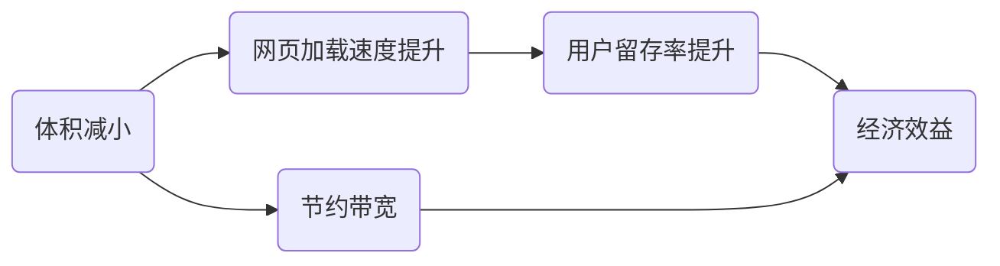
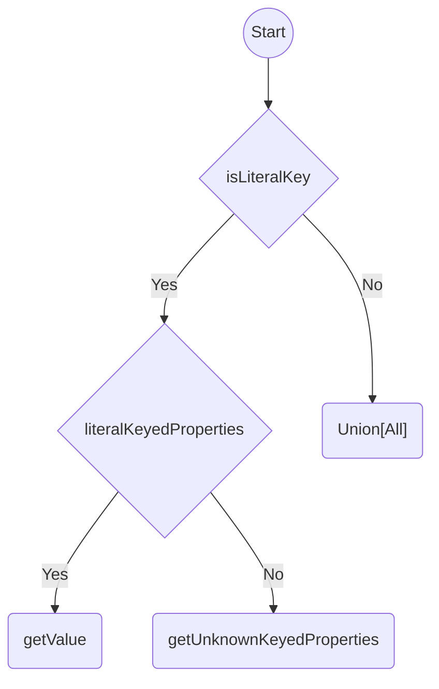
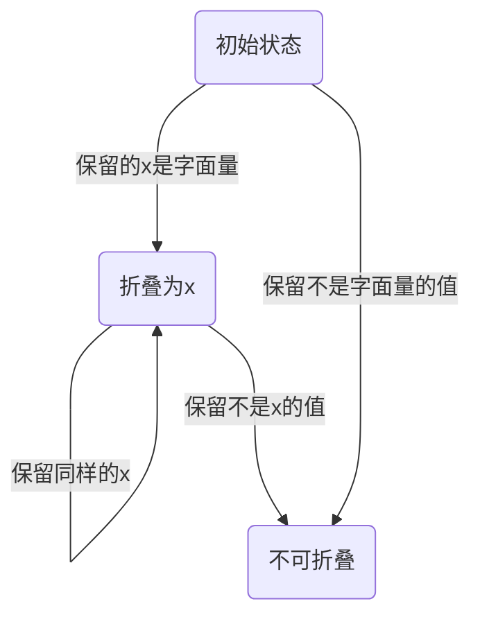
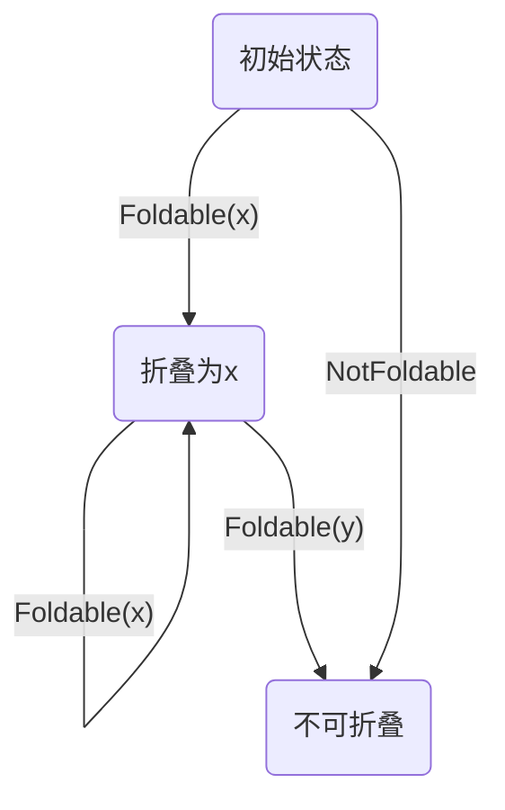
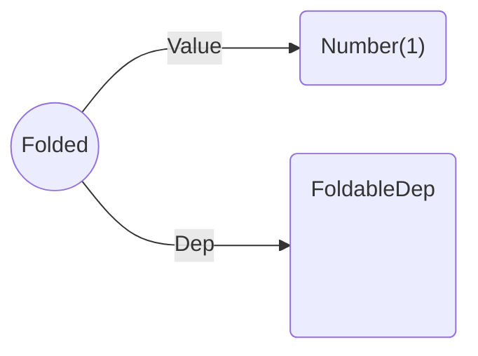
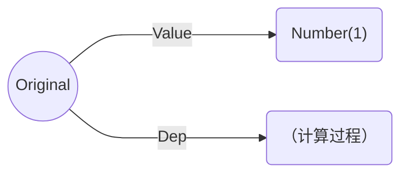
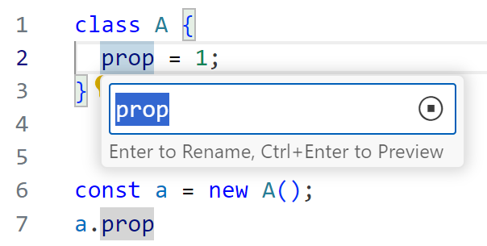

# JsShaker

语义层面的 JavaScript 代码体积优化器

---

# Motivations



- HTML/CSS/Media: 压缩技术成熟
- JS: **体积大，阻塞加载⭐**


---
dragPos:
  semantic: 362,129,385,80
  grammar: 362,230,421,80
  binary: 362,300,388,56
  note: 362,384,406,80
  title: 362,48,388,56
---

<div v-drag="'title'">

# The Levels

<div mt--5 op-60>
of JavaScript code size optimization
</div>

</div>

```js {*}{lines:false}
function greet(name) {
  pure();
  console.log("Hello, " + name);
}
greet("World");
```

```js {*}{lines:false}
function greet() {
  console.log("Hello, World");
}
greet();
```

```js {*}{lines:false,class:'children:children:children:(text-wrap break-all)'}
function greet(){console.log("Hello, World")}greet();
```

```txt {*}{lines:false}
010100110010101...
```

<div v-drag="'semantic'">

**Semantic Level** <br>
Tree-shaking，静态分析程序，优化不必要的代码

</div>
<div v-drag="'grammar'">

**Syntax Level** <br>
Minifier[*]{.text-red}，上下文无关，删除空格、重命名变量等

</div>
<div v-drag="'binary'">

**Binary Level** <br>
Gzip，编程语言无关，减小传输体积

</div>
<div v-drag="'note'" text-sm>

[*]{.text-red} [许多 Minifier 也会做简单的 Semantic Level 优化]{.op-50}

</div>


<style>
.slidev-code-wrapper {
  width: 38%;
}
.shiki {
  --uno: mt-4;
}
</style>

---

# Why Hard?

<!-- JavaScript 作为弱类型的解释型语言，具有高度的动态特性。它使用基于原型链的继承机制，并允许使用动态计算的属性名添加、删除和修改对象的属性和方法。这些特性使得 JavaScript 代码的静态分析变得非常困难。 -->

<div flex justify-between gap-8 pr-12>
<div>

- 弱类型
- 原型链＋动态属性名
- 函数是一等公民

</div><div>

- 真实存在的各种写法
- 大量代码无法精确分析

</div><div>

- 做最坏的假设
- 但又要保证效果

</div>
</div>

<div mt-4 grid grid-cols-2 gap-4>
<div>

```js {*}{lines:false}
const key = () => Math.random() > 0.5;
const obj = {
  __proto__: {
    [key()]: 1,
  },
  set [key()](x) {
    console.log(super[key()], x);
  }
}
obj[key()] = 10;
```

</div>
<div>

```js {*}{lines:false}
function cache(fn) {
  const cache = {};
  return x => cache[x] ??= fn(x);
}
const sigmoid = cache(
  x => 1 / (1 + Math.exp(-x))
);

// WTF?
setTimeout(sigmoid, 1000, 1);
```

</div>
</div>

---


# Why Hard?

<div h-2 />

一个简单的字符串拼接函数:
```js {*}{lines:false,class:'w-92'}
function concat(arr) {
  let res = "";
  for (let i = 0; i < arr.length; i++) {
    res += arr[i];
  }
  return res;
}
```

<div text-sm op-60 mt-18>

Source: [_Land ahoy: leaving the Sea of Nodes_](https://v8.dev/blog/leaving-the-sea-of-nodes) by the V8 team

</div>


<style scoped>
:deep(.slidev-code) {
  --slidev-code-font-size: 14px;
}
</style>

---

# Previous Work

[Rollup](https://rollupjs.org/), [Terser](https://terser.org/), [UglifyJS](https://github.com/mishoo/UglifyJS/), [Google Closure Compiler](https://github.com/google/closure-compiler)

缺陷：

- 基于规则，多 pass
- 缺少对象属性的重命名
- 高级优化要求所有的函数和对象都已知
- 可拓展性弱

---

Previous Work{.sect}

## Prepack

由 Facebook 推出，于 2021 年废弃


<div mb-2 flex gap-4>

```js {*}{lines:false,class:'w-64'}
for (let a = 1; a < 10; a++) {
  console.log(a)
}
```

<div i-carbon-arrow-right w-20 text-4xl op-60 mt-4 />

```js {*}{lines:false,class:'w-64'}
console.log(1);
console.log(2);
// ... x10
```

</div>

1. 内部实现过于复杂
2. 要求整个运行环境已知，降低了实用性

---

改进：

- 做抽象：不拘泥于标准，按照直观的 JS 语义分析代码

- 直接分析 AST 节点的使用情况，而不是收集和序列化副作用

---

# The Goals

<!-- - **High precision**: inter-procedural, context-sensitive and field-sensitive.
- **Soundiness**: 在合理的假设下，优化结果是正确的。
- **Single pass**: 优化是幂等的，只需执行一次。确保使用到全局的所有信息，并保证了优化效率。
- **Extendability**: 允许解耦地自定义外部函数的行为，提供专门的优化。 -->

<div grid grid-cols-2 gap-6 children:h-34>
<div border="2 #999999 rounded-lg" px-4 py-2>
  <div text-xl mb-2> High precision </div>
  <div class="!children:children:leading-6">

- inter-procedural
- context-sensitive 
- field-sensitive

</div>
</div>
<div border="2 #999999 rounded-lg" px-4 py-2>
  <div text-xl mb-2> Soundiness </div>
  <div> 仅作少数合理假设，<br>保证优化前后程序等价 </div>
</div>
<div border="2 #999999 rounded-lg" px-4 py-2>
  <div text-xl mb-2> Single Pass </div>
  <div> 优化是幂等的，只需执行一次 </div>
</div>
<div border="2 #999999 rounded-lg" px-4 py-2>
  <div text-xl mb-2> Extendability </div>
  <div> 允许解耦地自定义外部函数的行为，以提供专门的优化 </div>
</div>
</div>

---

# Design Overview

<DesignOverview />

---
class: Execution
---

## Analyzer{.sect} 顺序执行

<div grid grid-cols-2 gap-4>

```js {5|1|2|3}
function [[add]]([[x]], [[y]]) {
  const [[z]] = x + y;
  console.log(z);
}
add([[1]], [[2]]);
```

<div>

### Execution Dependencies

<v-clicks at="1">

- <Dep>add</Dep>

</v-clicks>

### Expressions

<v-clicks at="0">

- `add`: Function(L1-L4) <Deps float-right>1</Deps>
- `x`: Number(1) <Deps float-right>2,5</Deps> <br>
  `y`: Variable("y") <Deps float-right>3,6</Deps>
- `z`: Number(3) <Deps float-right>4,x,y</Deps>
- `console.log`: Unknown <Deps float-right></Deps>

</v-clicks>

</div>
</div>

---
class: Execution
---

## Analyzer{.sect} 分支

<div grid grid-cols-2 gap-4>

```js {1|2|3|4}
let [[x]] = 1;
if (a)
  x++;
console.log(x);
```

<div>

### Execution Dependencies

<div v-click="[2,3]">

- `a` is truthy

</div>

### Expressions

<v-clicks at="0">

- `x`: Number(1) <Deps float-right>1</Deps>
- `a`: Unknown <Deps float-right></Deps>
- `x'`: Number(2) <Deps float-right>x</Deps>
- `x''`: Union\[`x`, `x'`\] <Deps float-right>a</Deps> <br>
  `console.log`: Unknown <Deps float-right></Deps>

</v-clicks>

</div>
</div>

---
class: Execution
---

## Analyzer{.sect} 乱序


<div grid grid-cols-2 gap-4>

```js {1|2|3|6|3|7|8|3}
let x = 0, y = 0;
setInterval(() => {
  console.log(x, y);
}, 100);
// ...
x++;
x++;
y++;
```

<div mr--10>

<v-clicks at="1">

- `setInterval` 在未知时刻调用回调
- 先分析一次，发现依赖是 <Deps>x,y</Deps>
- `x` 改变了，它是回调函数的依赖
- 重新分析回调函数。新的依赖是 <Deps>y</Deps>
- `x` 又改变了，但它不再是回调函数的依赖
- `y` 改变了，它是回调函数的依赖
- 重新分析回调函数。新的依赖是 <Deps></Deps>

</v-clicks>

</div>
</div>

---

- **Drain**：每当自己写入了自己先前的依赖，就重新分析
- **Callback**：自己执行完后，对它的依赖的写入也需要触发重新分析

<div h-4 />

| **Kind** | **Drain** | **Callback** |
| ---- | ---- | ---- |
| Loop | Yes | No |
| Recursion | Yes | Yes |
| Generator / async | No | Yes |
| Untrackable | Yes | Yes |

---

# The Entity Model



---

# The "Value"s

<div grid grid-cols-5 gap-4>

<div border="2 #999999 rounded-lg" p-2 flex flex-col>
  <div text-center> Literal </div>
  <div font-mono text-xs>
  String("abc") <br>
  Number(42) <br>
  BigInt(42n) <br>
  Boolean(true) <br>
  Symbol(1) <br>
  Undefined <br>
  Null <br>
  </div>
  <div flex-grow />
  <div text-3 leading-2 op-70>
    AST-representable
  </div>
</div>

<div border="2 #999999 rounded-lg" p-2 flex flex-col>
  <div text-center> Primitive </div>
  <div font-mono text-xs>
  AnyString <br>
  AnyNumber <br>
  AnyBigInt <br>
  AnyBoolean <br>
  AnySymbol <br>
  AnyPrimitive
  </div>
  <div flex-grow />
  <div text-3 leading-2 op-70>
    non-"Object"
  </div>
</div>

<div flex flex-col gap-2>
<div border="2 #999999 rounded-lg" p-2>
  <div text-center> Object </div>
</div>
<div border="2 #999999 rounded-lg" p-2>
  <div text-center> Array </div>
</div>
<div border="2 #999999 rounded-lg" p-2>
  <div text-center> Function </div>
</div>
<div border="2 #999999 rounded-lg" p-2>
  <div text-center> React VNode </div>
</div>
</div>

<div flex flex-col gap-2>
<div border="2 #999999 rounded-lg" p-2>
  <div text-center> ⊤ Unknown </div>
</div>
<div border="2 #999999 rounded-lg" p-2>
  <div text-center> ∪ Union </div>
</div>
<div border="2 #999999 rounded-lg" p-2>
  <div text-center> ⊥ Never </div>
</div>
<div flex-grow />
</div>


<div flex flex-col gap-2 op-50>
<div border="2 #999999 rounded-lg" p-2>
  <div text-center> Arguments </div>
</div>
<div relative border="2 #999999 rounded-lg" p-2>
  <div text-center absolute text-sm w-full mx--2 mt-.5> Logical Result </div>
  <div text-center invisible> ___ </div>
</div>
</div>

</div>


复杂度与精确性的权衡

---

# The Object Value

<style>
h1 {
  font-size: 1.5rem;
  margin: 0 !important;
  margin-top: -28px !important;
}
</style>

<div relative flex gap-12>
<div>
<div text-center>
<codicon-key />
Key Space
</div>
<div relative flex flex-col gap-2 border="2 rounded-xl #0072B2 op-60" p-2>
<div flex flex-col gap-2 border="2 dashed rounded-lg  #999999" p-2>
<div text-xs ml-.5 mt--2 mb--2 font-mono font-bold op-60 text-center>
Literal Keyed
</div>
<div v-for="i in 3" border="2 #D55E00 rounded-lg op-60" px-2 h-16 :data-arrow-from="i" font-mono flex items-center justify-center>
  "key{{i}}"
</div>
</div>
<div flex-grow border="2 #999999 rounded-lg " px-2 data-arrow-from="rest"> 
<div text-xs ml-.5 font-mono font-bold op-60 text-center>
Rest Properties
</div>
<div font-mono flex items-center justify-center mb-2 py-2 font-bold>
  ...
</div>
</div>
<div absolute bottom-0 left-0 right--.3 h-10 data-arrow-from="unknown" />
</div>
</div>

<div flex flex-col gap-2 w-62>
<div text-center mb--2>
<codicon-symbol-field />
Value Space
</div>

<PropertyValue data-arrow-to="1" />
<PropertyValue data-arrow-to="2" />
<PropertyValue data-arrow-to="3" />
<PropertyValue :kind="2" data-arrow-to="rest" />
<PropertyValue :kind="3" data-arrow-to="unknown" />

<ArrowConn arrow-id="1" color="#E69E66"/>
<ArrowConn arrow-id="2" color="#E69E66"/>
<ArrowConn arrow-id="3" color="#E69E66"/>
<ArrowConn arrow-id="rest" color="#999999"/>
<ArrowConn arrow-id="unknown" color="#66AAD1"/>

</div>


<div flex flex-col gap-2 ml--2>
<div text-center mb--2>
<codicon-symbol-class />
Prototype
</div>
<div relative text-xs leading-3 flex text-center items-center>
  <div border="2 #009E73 op-60" rounded-lg p-1 pb-2 flex flex-col items-center w-16>
    <carbon-null-sign block my-1 />
    Null or<br>Implicit
  </div>
  <div text-11 mt--2 op-50 origin-center scale-x-60 font-bold> / </div>
  <div border="2 #009E73 op-60" rounded-lg p-1 pb-2 flex flex-col items-center w-16>
    <carbon-object block my-1 />
    Custom<br>Object
  </div>
  <div text-11 mt--2 op-50 origin-center scale-x-60 font-bold> / </div>
  <div border="2 #009E73 op-60" rounded-lg p-1 pb-2 flex flex-col items-center w-16>
    <carbon-help block my-1 />
    Unknown<br>Value
  </div>
</div>

<div text-center mb--2 mt-4>
<codicon-list-unordered />
Metadata
</div>
<div flex flex-col gap-2 text-xs text-center>
<div border="2 rounded-lg #999999 op-80" px-2 py-1> Consumed Flag </div>
<div border="2 rounded-lg #999999 op-80" px-2 py-1> Mangling Group ID </div>
<div border="2 rounded-lg #999999 op-80" px-2 py-1> Control-flow Scope ID </div>
<div border="2 rounded-lg #999999 op-80" px-2 py-1> ... </div>

</div>
</div>

</div>


---

# Object::get_property



---
dragPos:
  a: 64,94,146,76
  b: 347,305,126,42
  c: 261,361,128,42
  d: 445,97,128,60
  e: 435,180,128,42
  f: 409,244,128,42
---

## Optimizer{.sect} Dead Code Elimination

<div v-drag="'a'" data-arrow-from="b c d e f">

```js {*}{lines:false,class:'w-36 z-10'}
if (cond) A;
else B;
```

</div>
<div v-drag="'b'" data-arrow-to="b">

```js {*}{lines:false,class:'w-36'}
A;
```

</div>
<div v-drag="'c'" data-arrow-to="c">

```js {*}{lines:false,class:'w-36'}
B;
```

</div>
<div v-drag="'d'" data-arrow-to="d">

```js {*}{lines:false,class:'w-36'}
if (cond) A;
else B;
```

</div>
<div v-drag="'e'" data-arrow-to="e">

```js {*}{lines:false,class:'w-36'}
if (cond) A;
```

</div>
<div v-drag="'f'" data-arrow-to="f">

```js {*}{lines:false,class:'w-36'}
if (!cond) B;
```

</div>

<ArrowConn v-for="id in 'bcdef'" :arrow-id="id" color="#A5A5A5" />

<style scoped>
:deep(.slidev-code) {
  --slidev-code-font-size: 16px;
  --slidev-code-line-height: 1.6;
}
</style>

---

## Optimizer{.sect} Dead Code Elimination

条件真假不确定，还能优化吗？

<div flex gap-8>
<div>

```js {*}{lines:false,class:'w-68'}
function f(cond, callback) {
  if (cond) {
    callback();
  } else {
    console.log("else");
  }
}

f(truthyValue, pureFunction);
f(falsyValue, anything);
```

</div>
<div>

<div i-carbon-arrow-right w-12 text-4xl op-60 mt-4 />

</div>
<div>

```js {*}{lines:false,class:'w-68'}
function f() {
	console.log("else");
}

f();
```

<div mt-10>
如果整个函数调用被删除，<br>
则其对应的执行情况无需被考虑。
</div>

</div>
</div>

<style scoped>
:deep(.slidev-code) {
  --slidev-code-font-size: 14px;
  --slidev-code-line-height: 1.4;
}
</style>

---

## Optimizer{.sect} 死分支消除

<div>
Post Analysis:
</div>

```txt {*}{lines:false}
branchWorkList = all executed branches
nodeWorkList = all conditional nodes
changed = true
while changed:
  for B in branchWorkList:
    if B's closest parent function call is preserved:
      if the opposite of B is not pure:
        preserve B's possibility
        remove B from branchWorkList

  changed = false
  for N in nodeWorkList:
    if N may enter both consequent and alternative:
      consume N's all test values
      remove N from nodeWorkList
      changed = true
```

---

### 常量折叠

当一个节点在运行时只可能出现一种字面量值，就可以将其折叠为字面量值。

而此处的“运行时”是指优化后的运行时，需要考虑死代码消除的影响。比如：

<div flex>

```js {*}{lines:false,class:'w-64'}
function f(value) {
  return { data: [[value]] };
}
const a = f(1), b = f(2);
x = a;
```

<div i-carbon-arrow-right w-20 text-4xl op-60 mt-4 />

```js {*}{lines:false,class:'w-64'}
function f() {
  return { data: [[1]] };
}
const a = f();
x = a;
```

</div>

只有在 `b` 作为无用代码被删除后，`f` 里的 `value` 才能折叠。

<style scoped>
:deep(.slidev-code) {
  --slidev-code-font-size: 14px;
  --slidev-code-line-height: 1.4;
}
</style>

---

### 常量折叠

<div grid grid-cols-3 gap-2>



<div text-center flex flex-col items-center>

转换为依赖

<carbon-arrow-right w-20 text-5xl op-60 mt-2 />

<div text-sm mt-4 w-fit>

- Foldable(x)
- NotFoldable

</div>

</div>



</div>

---
clicks: 1
---

### 常量折叠

如何删除/保留计算过程？

<div absolute left-20 top-30 transition-all duration-300 delay-300 :class="$clicks === 0 ? 'op-0' : ''">



</div>

<div absolute transition-all duration-600 :class="$clicks === 0 ? 'left-20 top-30' : 'left-76 top-58'" >



</div>

---


---

## Optimizer{.sect} Property Name Mangling

<div />

Minifier 能完美地重命名变量名，比如：

```js {*}{lines:false}
const [[variableName]] = { [[propertyName{3}]]: 42 };
log([[variableName]].[[propertyName{3}]] * 2);
```

输出为：

```js {*}{lines:false}
let [[e]]={[[propertyName{3}]]:42};log([[e]].[[propertyName{3}]]*2)
```

但 <code><span depatom="{3}" color="#B07D48">propertyName</span></code> 仍是原始的字符串。

据估计，属性名约占 Minifier 输出代码体积的 [30%]{.font-mono.font-bold}。

<style scoped>
.shiki {
  --slidev-code-font-size: 14px;
  --slidev-code-line-height: 1.6;
}
</style>

---

## Optimizer{.sect} Property Name Mangling

[Terser](https://terser.org/) 和 [UglifyJS](https://github.com/mishoo/UglifyJS/) 支持此功能，但无法保证基本的正确性。比如：

```js {*}{lines:false}
const obj = { [[foo{1}]]: v1, [[bar{3}]]: v2 };
const key = t1 ? "[[foo{1}]]" : "[[bar{3}]]";
log(obj.[[foo{1}]], obj[key]);
```

会被错误地优化为：

```js {*}{lines:false}
const obj = { [[a{1}]]: v1, [[b{3}]]: v2 };
const key = t1 ? "[[foo{4}]]" : "[[bar{4}]]";
log(obj.[[a{1}]], obj[key]);
```

基于规则的局限性：效果好和正确性不可兼得 {.text-xl}

---

## [Optimizer ❯  Property Name Mangling]{.sect}

### VSCode's Typing-based Approach {.my-4.font-serif}

- 编写脚本调用 TypeScript 提供的 **代码重构 ❯ 重命名** 功能
- 优点：用很少的代码实现了很好的效果
- 缺点：高度依赖类型注解<br>&emsp;&emsp;&emsp;无法处理第三方库的代码
- 无法用于一般的应用程序

据[官方博客](https://code.visualstudio.com/blogs/2023/07/20/mangling-vscode)，此项优化节约了 [14%]{.font-bold.font-mono} 的体积。



---

## Optimizer{.sect} Property Name Mangling

优化的本质是**重命名字符串**，比如将：

```js {*}{lines:false}
const s1 = "[[hello{1}]]";
const s2 = unknown ? "[[hello{1}]]" : "[[world{3}]]";
console.log(s1 === s2);
```

优化为：

```js {*}{lines:false}
const s1 = "[[a{1}]]";
const s2 = unknown ? "[[a{1}]]" : "[[b{3}]]";
console.log(s1 === s2);
```

为什么可以优化？因为有意义的是相等性，而非字符串本身。

---
class: Execution
zoom: 0.9
---

## Optimizer{.sect} Property Name Mangling

<div h-1 />

```js {1|2|3}
const a = "[[hello]]";
const b = unknown ? "[[hello]]" : "[[world]]";
const c = a === b;
```

<v-clicks at="0">

- `a`: String("hello") <Deps float-right><span><span text-dep>NOMANGLE</span>(<Dep>atom(1)</Dep>)</span></Deps>
- <code>b<sub>1</sub></code>: String("hello") <Deps float-right><span><span text-dep>NOMANGLE</span>(<Dep>atom(2)</Dep>)</span></Deps>
<br> <code>b<sub>2</sub></code>: String("world") <Deps float-right><span><span text-dep>NOMANGLE</span>(<Dep>atom(3)</Dep>)</span></Deps>
<br> `b`: Union\[<Dep><code>b<sub>1</sub></code></Dep>, <Dep><code>b<sub>2</sub></code></Dep>\] <Deps float-right></Deps>
- <code>c<sub>1</sub></code>: Boolean(true) <Deps float-right v-mark.box.red="{at:3}"><span><span text-dep>EQUAL</span>(<Dep>atom(1)</Dep>,<Dep>atom(2)</Dep>)</span></Deps>
<br> <code>c<sub>1</sub></code>: Boolean(false) <Deps float-right v-mark.box.red="{at:3}"><span><span text-dep>UNEQUAL</span>(<Dep>atom(1)</Dep>,<Dep>atom(3)</Dep>)</span></Deps>
<br> <code>c</code>: Union\[<Dep><code>c<sub>1</sub></code></Dep>, <Dep><code>c<sub>2</sub></code></Dep>\] <Deps float-right></Deps>

</v-clicks>

<div text-red v-drag="[473,340,143,NaN]" font-bold bg-red-100 px-4 py-2 leading-8 v-click="3">
Not <Deps><code>a</code>,<code>c<sub>1</sub></code></Deps> <br>
Not <Deps><code>a</code>,<code>c<sub>2</sub></code></Deps>
</div>

<style scoped>
:deep(.rough-annotation) {
  transform: scale(calc(1 / 0.9 / var(--slidev-slide-scale)));
}
</style>

---

## Optimizer{.sect} Property Name Mangling

Possible dependencies for this optimization:

| | |
| ---- | ---- |
| <Dep><span text-dep>NOMANGLE</span>(<Dep>atom(1)</Dep>)</Dep> | <Dep>atom(1)</Dep> should remain unchanged |
| <Dep><span text-dep>EQUAL</span>(<Dep>atom(1)</Dep>,<Dep>atom(2)</Dep>)</Dep> | <Dep>atom(1)</Dep> and <Dep>atom(2)</Dep> should be equal |
| <Dep><span text-dep>UNEQUAL</span>(<Dep>atom(1)</Dep>,<Dep>atom(2)</Dep>)</Dep> | <Dep>atom(1)</Dep> and <Dep>atom(2)</Dep> should not be equal |
| <Dep><span text-dep>UNIQUE</span>(<Dep>group(1)</Dep>,<Dep>atom(1)</Dep>)</Dep> | <Dep>atom(1)</Dep> should be unique among <Dep>group(1)</Dep> |

---

## Optimizer{.sect} Property Name Mangling

How to resolve?

<!-- <div class="slidev-code !text-0.9rem">
EqualityGroups
UniquenessGroups
for each <span text-dep>dep</span> in 
</div> 

atomStates = { * -> any }
uniquenessGroups = []
identityGroups = []

for each C in all constraints:
  if C is NOMANGLE(A):
    atomStates[A] -> NOMANGLE
  else if C is EQUAL(A,B):
    if atomStates[A] is NOMANGLE:
      atomSta
  else if C is <span text-dep>NOMANGLE</span>:
    atomStates[C.atom] = C.atom
-->


---

## Optimizer{.sect} Property Name Mangling

静态属性名本质上仍是字符串：

````md magic-move
```js {*}{lines:false}
const obj = {
  foo: 1,
};
obj.foo++;
```

```js {*}{lines:false}
const obj = {
  ["foo"]: 1,
};
obj["foo"]++;
```
````

- 一个对象内的各属性的名字须保持不同
- 访问原型链亦可视为字符串判等
- 所有动态访问情况都可以处理

<style scoped>
:deep(.slidev-code) {
  --slidev-code-font-size: 18px;
  --slidev-code-line-height: 2;
}
</style>

---

# Evaluation

<div flex items-end gap-1 text-sm op-70 v-drag="[248,54,300,21]">
<carbon-logo-github /> <a href="https://github.com/mischnic/tree-shaking-example">mischnic/tree-shaking-example</a>
</div>

| Name | Saved | Time | Input Size\* | Output Size\* |
| ---- | ---- | ---- | ---- | ---- |
| react-icons | 58.12% | 51ms | 9099B | 3811B |
| lodash-es | 44.98% | 34ms | 7108B | 3911B |
| rambdax | 44.95% | 11ms | 2089B | 1150B |
| material-ui | 44.03% | 3013ms | 180114B | 100807B |
| rxjs | 11.73% | 20ms | 2728B | 2408B |
| remeda | &nbsp;8.92% | 11ms | 986B | 898B |
| rambda | &nbsp;5.62% | 9ms | 587B | 554B |
| sentry | &nbsp;3.48% | 1557ms | 24477B | 23625B |
| lodash | &nbsp;1.11% | 7791ms | 25882B | 25595B |
| ramda | &nbsp;0.87% | 1743ms | 1952B | 1935B |

<div mt-6 italic op-80 text-sm>

\* Input files are bundled by [Rollup]{.font-mono} with its tree-shaking ON. <br>
\* Minified by [oxc-minifier]{.font-mono} and Gzipped with compression level 6.

</div>

<style scoped>
table {
  --uno: text-sm mt--2;
}
:deep(td) {
  padding: 0 0.5rem !important;  
}
:deep(td:not(:first-child)) {
  --uno: font-mono;
}
:deep(td:first-child) {
  --uno: font-bold;
}
:deep(td:nth-child(2)) {
  --uno: font-bold;
}
</style>

---
layout: end
---

Thank you!
